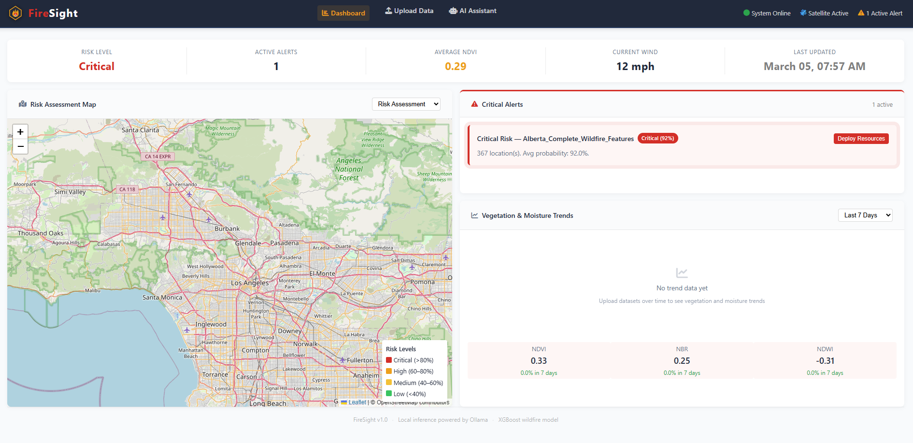
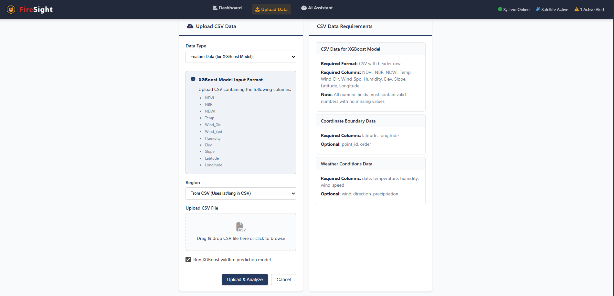
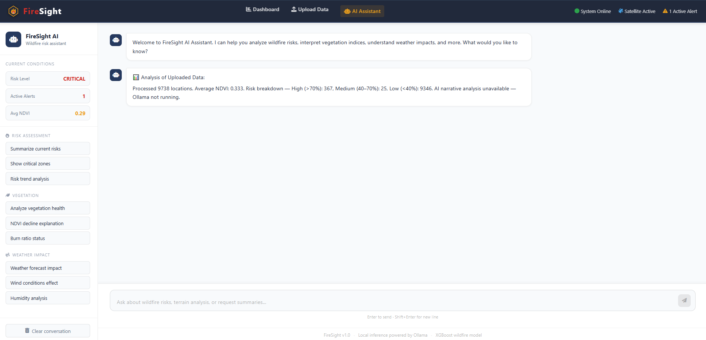

# FireSight — Wildfire Risk Assessment Dashboard

A full-stack wildfire risk assessment tool built for offline, field-deployable use. Upload satellite-derived CSV data, run an XGBoost wildfire prediction model, and analyze results through an interactive dashboard and a locally-run AI assistant — no internet connection required.



## Why This Exists

Wildfire responders and field analysts often operate in areas with limited or no internet connectivity. Existing tools rely on cloud services, making them unavailable exactly when they're needed most. FireSight is designed to run entirely on local hardware — from a laptop to a Raspberry Pi — processing data and serving AI-assisted analysis without any external dependencies.

## Features

- **Upload-Driven Dashboard** — the dashboard populates from your data. Upload a CSV of field or satellite measurements and the risk map, alert panel, and statistics update automatically.
- **XGBoost Wildfire Prediction** — classifies each location's wildfire probability from spectral indices (NDVI, NBR, NDWI) and weather features (temperature, humidity, wind speed, elevation, slope).
- **Interactive Risk Map** — zones are color-coded by severity (Critical / High / Medium / Low) with per-zone popups showing indices and terrain details. Map auto-fits to uploaded data bounds.
- **Active Alerts Panel** — surfaces critical and high-risk zones with severity badges and recommended actions.
- **Vegetation & Moisture Trends** — tracks NDVI, NBR, and NDWI over 7, 30, and 90-day windows.
- **Local AI Assistant** — powered by Ollama running `gemma2:2b` (or any compatible model). Answers natural language questions about risk data and uploaded predictions. No data leaves the machine.
- **Demo Mode** — load built-in seed data to explore the interface without a real dataset.

## Screenshots

### Dashboard


### Upload Data


### AI Assistant


## Tech Stack

| Layer | Technology |
|---|---|
| Frontend | React 18, Vite, react-leaflet, Chart.js |
| Backend | Flask, SQLAlchemy, SQLite |
| ML Model | XGBoost classifier (scikit-learn pipeline) |
| AI Assistant | Ollama (local inference, `gemma2:2b` default) |
| Map tiles | OpenStreetMap via Leaflet |

## Project Structure

```
WildfireRiskAid/
├── backend/
│   ├── app.py               # Flask API, DB models, ML inference, Ollama integration
│   ├── requirements.txt
│   └── uploads/             # Uploaded CSV files
├── frontend/
│   ├── src/
│   │   ├── pages/           # Dashboard, Upload, Chat
│   │   └── components/      # Navbar, RiskMap, AlertsPanel, IndicesChart, Footer
│   └── vite.config.js       # Proxy config (/api and /upload → localhost:5000)
├── predictive_model/
│   ├── XgBoost/             # Trained model (.joblib) + training notebook
│   ├── RandomForest/        # Baseline model
│   ├── DataExtraction/      # Google Earth Engine scripts (Sentinel-2 / Landsat 8)
│   └── Preprocessing/       # Feature engineering pipeline
├── docs/screenshots/
└── start.sh                 # Starts both servers with a single command
```

## Dataset

The XGBoost model was trained on satellite imagery sourced from **Sentinel-2** and **Landsat 8** via **Google Earth Engine**, covering Alberta wildfire seasons (May–September 2023/2024), approximately 5,000 sampled geographic points.

| Feature | Description |
|---|---|
| NDVI | Vegetation health — low values indicate dry or stressed vegetation |
| NBR | Burn ratio — low values suggest burn signatures or fuel accumulation |
| NDWI | Moisture content — low values indicate dry, fire-prone conditions |
| Temp | Surface temperature (°C) |
| Humidity | Relative humidity (%) |
| Wind_Spd / Wind_Dir | Wind speed (km/h) and direction (degrees) |
| Elev / Slope | Elevation (m) and terrain slope (degrees) |

Fire-risk labels were generated using a vegetation threshold rule (NDVI < 0.2 and NBR < 0.3 → high risk) in the absence of ground-truth fire perimeter data. Model accuracy: ~99% on the labeled dataset. A Random Forest baseline was trained for comparison.

## Getting Started

### Requirements

- Python 3.9+
- Node.js 18+
- [Ollama](https://ollama.com) (optional — required for AI assistant)

### 1. Clone and install

```bash
git clone https://github.com/your-username/WildfireRiskAid.git
cd WildfireRiskAid

# Backend
cd backend && pip install -r requirements.txt && cd ..

# Frontend
cd frontend && npm install && cd ..
```

### 2. Start both servers

```bash
bash start.sh
```

Or manually:

```bash
# Terminal 1
cd backend && python app.py        # → http://localhost:5000

# Terminal 2
cd frontend && npm run dev         # → http://localhost:5173
```

### 3. AI Assistant (optional)

Install [Ollama](https://ollama.com), then pull the default model:

```bash
ollama pull gemma2:2b
ollama serve
```

The app runs fully without Ollama — the AI assistant will show a fallback message if it's not running.

### 4. Environment variables (optional)

Create a `.env` file in `backend/` to override defaults:

```env
OLLAMA_URL=http://localhost:11434
OLLAMA_MODEL=gemma2:2b
XGB_MODEL_PATH=../predictive_model/XgBoost/xgboost_wildfire_model.joblib
```

## CSV Upload Format

To use the prediction model, upload a CSV with the following columns:

```
NDVI, NBR, NDWI, Temp, Wind_Dir, Wind_Spd, Humidity, Elev, Slope
```

Optional columns for map visualization:

```
Latitude, Longitude
```

